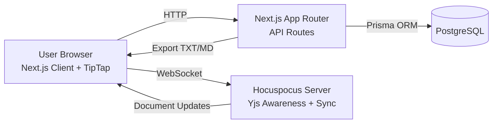

# Chandra Notepad

Realtime collaborative online notepad dengan URL dinamis (model notepad.pw), lock PIN, dan export TXT/MD.

## Highlights

- Room otomatis dari URL (`/:slug`) tanpa setup manual.
- Kolaborasi realtime berbasis CRDT (Yjs + Hocuspocus + TipTap).
- Rich text editor (bold, italic, underline, list, code block, undo/redo).
- Lock note dengan PIN 4-6 digit (hash bcrypt + token akses sementara).
- Export dokumen ke `.txt` dan `.md`.
- Tema `light/dark`, bahasa `ID/EN`, dan notifikasi aksi penting.
- Siap dijalankan lokal maupun containerized (Docker Compose).

## Architecture



## Tech Stack

- Frontend: Next.js 15, React 19, TypeScript, Tailwind CSS
- Editor Realtime: TipTap, Yjs, Hocuspocus
- Backend: Next.js Route Handlers (API)
- Database: PostgreSQL + Prisma
- Deployment: Docker, PM2, Nginx

## Project Structure

```text
notepad-online/
|-- src/
|   |-- app/
|   |   |-- [slug]/page.tsx
|   |   |-- api/
|   |   |   |-- notes/
|   |   |   |   |-- [slug]/route.ts
|   |   |   |   |-- [slug]/save/route.ts
|   |   |   |   |-- [slug]/lock/route.ts
|   |   |   |   |-- [slug]/unlock/route.ts
|   |   |   |   |-- [slug]/export/route.ts
|   |   |-- layout.tsx
|   |   |-- page.tsx
|   |   `-- globals.css
|   |-- components/
|   |   |-- editor/notepad-editor.tsx
|   |   |-- home/landing-form.tsx
|   |   `-- ui/
|   |       |-- button.tsx
|   |       |-- app-settings-controls.tsx
|   |       `-- use-app-settings.ts
|   `-- lib/
|       |-- prisma.ts
|       |-- validators.ts
|       `-- tiptap-extensions.ts
|-- prisma/
|   |-- schema.prisma
|   `-- migrations/
|-- scripts/start.sh
|-- docker-compose.yml
|-- Dockerfile
|-- ecosystem.config.cjs
`-- nginx/notepad.conf
```

## Quick Start (Local)

1. Copy environment file.

```bash
cp .env.example .env
```

2. Install dependencies.

```bash
npm install
```

3. Jalankan PostgreSQL lokal (atau via Docker).

4. Generate Prisma client dan sinkronkan schema.

```bash
npm run prisma:generate
npm run prisma:migrate
```

5. Jalankan aplikasi.

```bash
npm run dev
```

Endpoint default:

- Web app: http://localhost:7800
- Collab WS: ws://localhost:1234

## Docker Deployment

1. Pastikan `.env` sudah terisi.
2. Build dan jalankan service.

```bash
docker compose up -d --build
```

3. Verifikasi service.

```bash
docker compose ps
docker compose logs -f app
```

Default port:

- App: `7800`
- Postgres: `5432`
- Collab: `1234`

## Production Deployment (PM2 + Nginx)

1. Build production assets.

```bash
npm install
npm run build
```

2. Jalankan process manager.

```bash
pm2 start ecosystem.config.cjs
pm2 save
```

3. Setup reverse proxy Nginx menggunakan `nginx/notepad.conf`.
4. Pastikan WebSocket upgrade aktif untuk endpoint kolaborasi.
5. Aktifkan HTTPS (Let's Encrypt atau sertifikat internal).

## API Overview

- `GET /api/notes/:slug` - Ambil note (auto-create jika belum ada).
- `POST /api/notes/:slug/save` - Simpan konten editor (JSON TipTap).
- `POST /api/notes/:slug/lock` - Kunci note dengan PIN.
- `POST /api/notes/:slug/unlock` - Buka lock dan dapatkan token akses.
- `GET /api/notes/:slug/export?format=txt|md` - Export konten ke file.

## Security Notes

- Set `NOTE_AUTH_SECRET` ke secret acak yang panjang.
- Jalankan semua traffic production melalui HTTPS.
- Tambahkan backup database terjadwal.
- Terapkan observability (logs, metrics, uptime checks).

## Open Source Guide

1. Fork repository ini.
2. Buat branch fitur: `feat/nama-fitur`.
3. Commit perubahan dengan pesan yang jelas.
4. Pastikan build dan test lulus.
5. Buka Pull Request ke branch utama.

## License

Proyek ini menggunakan lisensi BSD 3-Clause.

- Lihat detail lisensi: `LICENSE`
- Lihat panduan atribusi/tag sumber: `NOTICE`

Ketentuan wajib tag sumber:

1. Jika melakukan redistribusi source code, wajib mempertahankan copyright notice dan file lisensi.
2. Jika mendistribusikan binary/deploy hasil turunan, wajib menyertakan copyright notice + lisensi di dokumentasi/material distribusi.
3. Direkomendasikan mencantumkan kredit: "Source: Chandra Notepad" beserta URL repository sumber.


